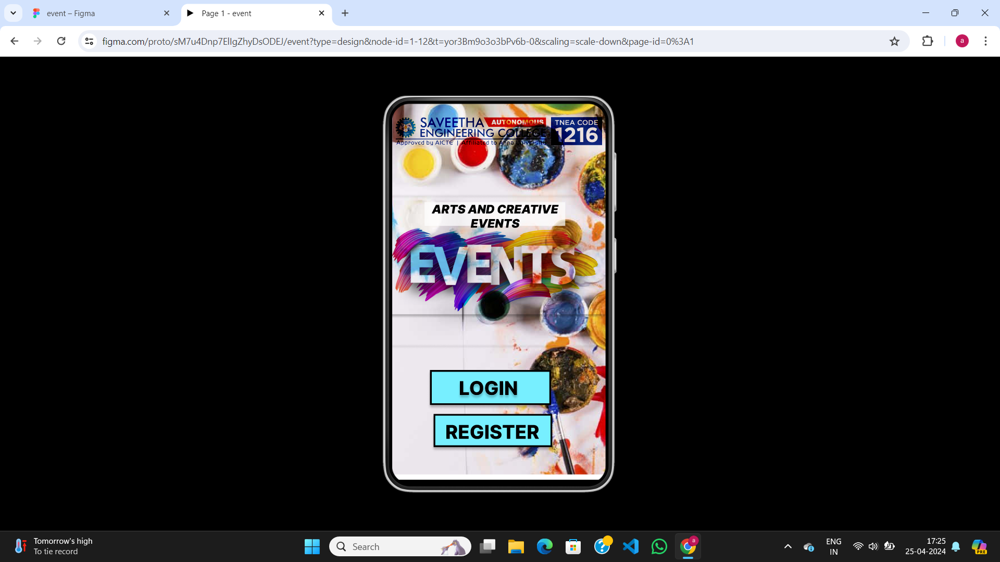
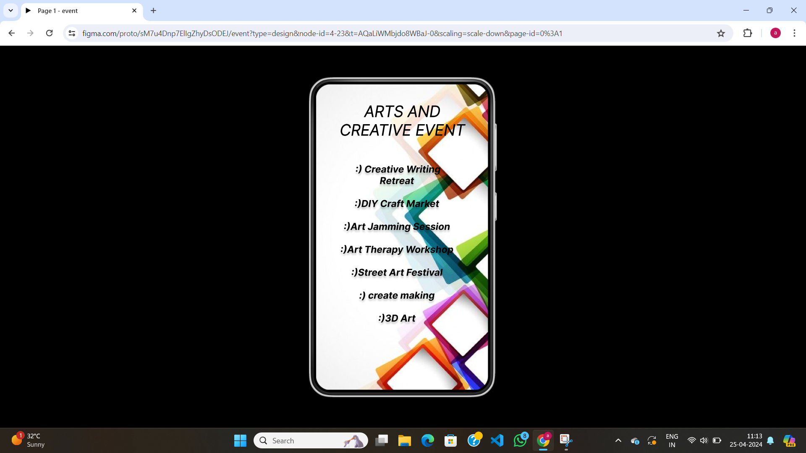

# Ex09 Event Registration Web Application
## Date:25/04/2024

## AIM:
To design, develop and deploy a web application for event registration.

## DESIGN STEPS:

### Step 1:
Create a new frame.

### Step 2:
Select any one preset size of your choice.

### Step 3:
Select the shapes you need.

### Step 4:
Import images as needed.

### Step 5:
Create pages based on your need and link them.

### Step 6:

Validate the HTML and CSS code.

### Step 6:

Publish the website in the given URL.

## DESIGN TOOL:
Figma

## CODE:
first page
```
<div style="width: 360px; height: 634px; position: relative; background: white">
  
  <div style="width: 198px; height: 53px; left: 67px; top: 452px; position: absolute; background: #77EFFF; box-shadow: 0px 4px 4px rgba(0, 0, 0, 0.25); border: 3px black solid"></div>
  <div style="width: 193px; height: 45px; left: 66px; top: 460px; position: absolute; text-align: center; color: black; font-size: 32px; font-family: Inter; font-weight: 800; word-wrap: break-word">LOGIN</div>
  <div style="width: 194px; height: 50px; left: 73px; top: 526px; position: absolute; background: #77EFFF; box-shadow: 0px 4px 4px rgba(0, 0, 0, 0.25); border: 3px black solid"></div>
  <div style="width: 192px; height: 50px; left: 73px; top: 534px; position: absolute; text-align: center; color: black; font-size: 32px; font-family: Inter; font-weight: 800; word-wrap: break-word">REGISTER</div>
  <div style="width: 360px; height: 159px; left: 0px; top: 87px; position: absolute">
    <div style="width: 237px; height: 40px; left: 55px; top: 79px; position: absolute; mix-blend-mode: hard-light; background: #D9D9D9"></div>
    <div style="width: 237px; height: 40px; left: 55px; top: 79px; position: absolute; text-align: center; color: black; font-size: 20px; font-family: Inter; font-style: italic; font-weight: 900; word-wrap: break-word">ARTS AND CREATIVE EVENTS</div>
  </div>
  
  
</div>
```

second page
```
<div style="width: 360px; height: 640px; padding-top: 37px; padding-bottom: 197px; padding-left: 47px; padding-right: 46px; background-image: url(https://via.placeholder.com/360x640); flex-direction: column; justify-content: flex-start; align-items: flex-start; gap: 15px; display: inline-flex">
  <div style="width: 267px; height: 114px; text-align: center; color: black; font-size: 32px; font-family: Inter; font-style: italic; font-weight: 300; word-wrap: break-word">ARTS AND CREATIVE EVENT</div>
  <div style="width: 245px; height: 277px; text-align: center; color: black; font-size: 20px; font-family: Inter; font-style: italic; font-weight: 700; word-wrap: break-word"> :) Creative Writing Retreat<br/><br/>:)DIY Craft Market<br/><br/>:)Art Jamming Session<br/><br/>:)Art Therapy Workshop<br/><br/>:)Street Art Festival<br/><br/>:) create making<br/><br/>:)3D Art</div>
</div>
```

third page
```
<div style="width: 360px; height: 640px; position: relative; background-image: url(https://via.placeholder.com/360x640)">
  <div style="width: 262px; height: 69px; left: 36px; top: 58px; position: absolute; text-align: center; color: black; font-size: 24px; font-family: JejuMyeongjo; font-weight: 400; word-wrap: break-word">EVENT REGISTRATION FORM</div>
  <div style="width: 170px; height: 35px; left: 10px; top: 127px; position: absolute; text-align: center; color: black; font-size: 15px; font-family: JejuMyeongjo; font-weight: 400; word-wrap: break-word">fill the details</div>
  <div style="width: 270px; height: 32px; left: 28px; top: 161px; position: absolute; background: white"></div>
  <div style="width: 394px; height: 20px; left: -96px; top: 167px; position: absolute; text-align: center; color: black; font-size: 20px; font-family: Irish Grover; font-weight: 400; word-wrap: break-word">FULL NAME:          </div>
  <div style="width: 270px; height: 36px; left: 28px; top: 211px; position: absolute; background: white"></div>
  <div style="width: 268px; height: 38px; left: 30px; top: 266px; position: absolute; background: white"></div>
  <div style="width: 265px; height: 37px; left: 28px; top: 328px; position: absolute; background: white"></div>
  <div style="width: 265px; height: 37px; left: 33px; top: 438px; position: absolute; background: #D9D9D9"></div>
  <div style="width: 264px; height: 38px; left: 34px; top: 493px; position: absolute; background: #D9D9D9"></div>
  <div style="width: 264px; height: 35px; left: 34px; top: 545px; position: absolute; background: #78ED50"></div>
  <div style="width: 265px; height: 36px; left: -21px; top: 216px; position: absolute; text-align: center; color: black; font-size: 20px; font-family: Irish Grover; font-weight: 400; word-wrap: break-word">REGISTER NO.:   </div>
  <div style="width: 374px; height: 30px; left: -81px; top: 274px; position: absolute; text-align: center; color: black; font-size: 20px; font-family: Irish Grover; font-weight: 400; word-wrap: break-word">DEPARTMENT:</div>
  <div style="width: 266px; height: 33px; left: -58px; top: 333px; position: absolute; text-align: center; color: black; font-size: 20px; font-family: Irish Grover; font-weight: 400; word-wrap: break-word">YEAR:</div>
  <div style="width: 259px; height: 33px; left: -25px; top: 446px; position: absolute; text-align: center; color: black; font-size: 20px; font-family: Irish Grover; font-weight: 400; word-wrap: break-word">MOBILE NO,:</div>
  <div style="width: 259px; height: 32px; left: -35px; top: 499px; position: absolute; text-align: center; color: black; font-size: 20px; font-family: Irish Grover; font-weight: 400; word-wrap: break-word">EMAIL ID:</div>
  <div style="width: 265px; height: 35px; left: 28px; top: 550px; position: absolute; text-align: center; color: black; font-size: 20px; font-family: Irish Grover; font-weight: 400; word-wrap: break-word">SUBMIT</div>
</div>
```

## OUTPUT:




## RESULT:
The program to design, develop and deploy a web application for event registration is completed successfully.
